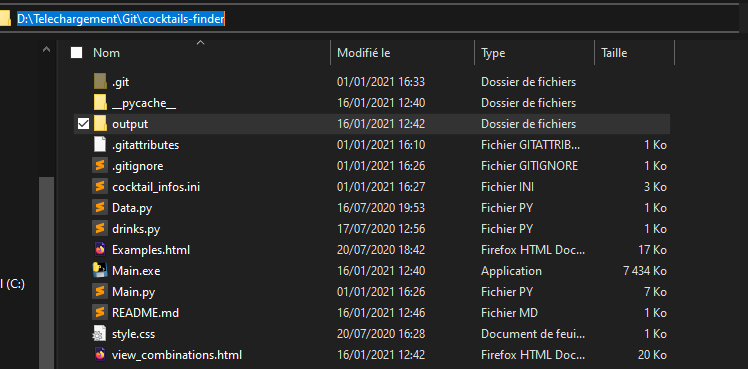

# cocktails finder
 Small tool to help you choose which ingredients to buy in order to maximize the number of cocktails you can prepare with those ingredients only.

 There is a pre set list of cocktails (in french), but you can change them in order to fit your needs.

 The recipes are not full, this is intentional because the only ingredients to be selected are the one to be considered expensive/difficult to find, reffered as key_ingredients in the code (for example orange juice is definetly not one of those obviously, but is present in some cocktails).

# How to use for non-programmers

#Step 1 
open your terminal :
- search cmd in windows
- or type windows key + R and type cmd then enter

#Step 2
Navigate to where you unzipped the file in terminal :

- Open folder location in windows explorer (normally) :
- Copy file path with ctrl+C
- in terminal, type cd then ctrl+V
- command example => cd D:\Telechargement\Git\cocktails-finder

Note, if you have several Hard drive on your computer (C: and D:) make sure the right one is selected.
If not, you can change it with "C:" or "D:" before entering any other command.

#Step 3
Execute the program :

This program takes 2 arguments : price and number of ingredients.
-b => price
-n => number of ingredients

Command example (once you are in the same directory than the .exe) : Main.exe -b 100 -n 4 
this command find the better combination of 4 ingredients with 100€ of budget.

The results are displayed on the console and in an html file that will be opened by your default browser.

Enjoy ;)